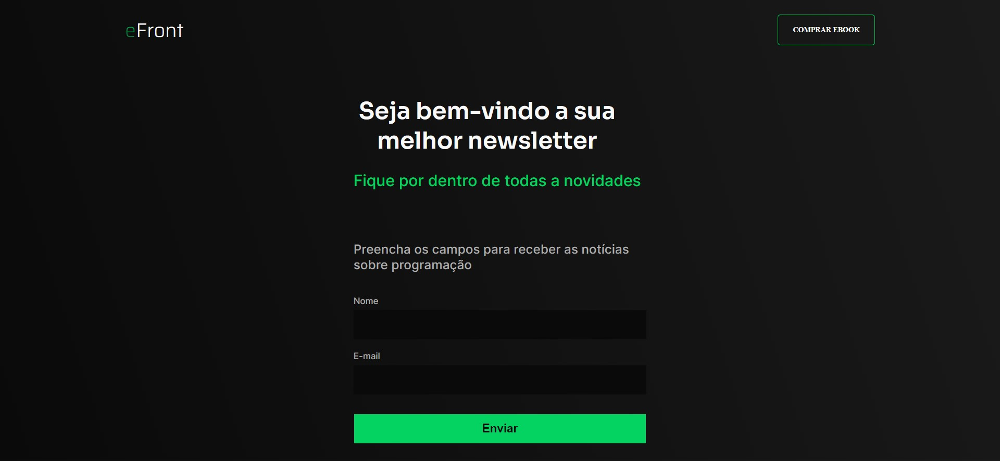

 

<h1 align="center">Efront Desafio</h1>

<!-- ABOUT THE PROJECT -->
## Sobre o projeto

Esse projeto foi criado para fins de estudo do e-book Efront do <a href="https://github.com/iuricode">iuricode</a>, o desafio era recriar um layout dado no figma para simular uma newsletter.

### Criado com

Foi usado para construir as seguintes ferramentas: 

1. HTML5
2. CSS3
3. JavaScript

<!-- GETTING STARTED -->
## Para ver esse site online

Você entrar pelo link abaixo e será redirecionado para a página hospedada.

[Ver site](https://ericodesenvolvedor.github.io/eFront-desafio/)

<!-- CONTACT -->
## 📫 Contato

Instagram - [@ericodesenvolvedor](https://instagram.com/ericodesenvolvedor/)

Linkedin: [Eric Oliveira](https://www.linkedin.com/in/eric-de-oliveira-pereira/)